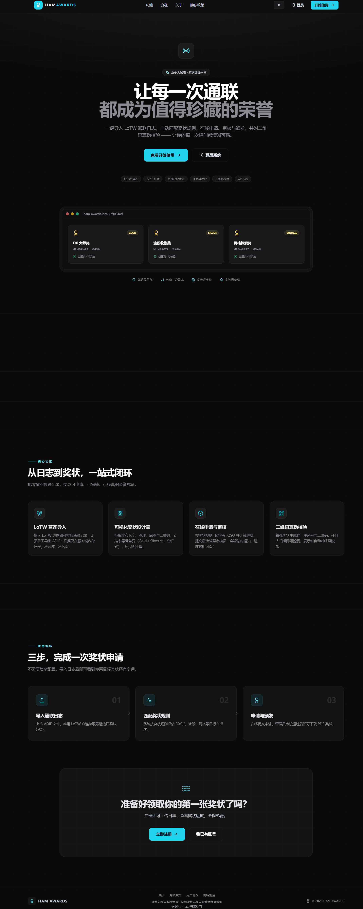
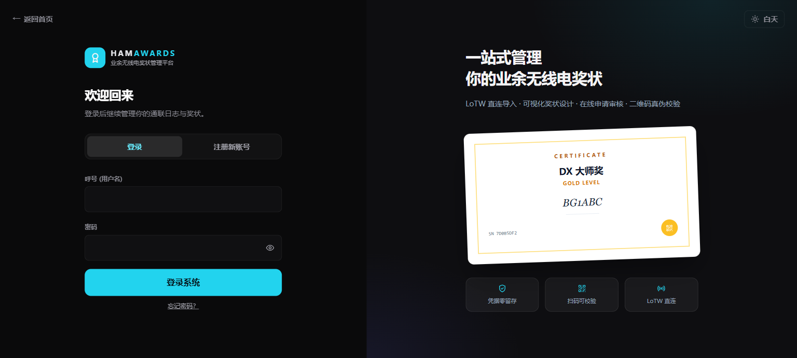
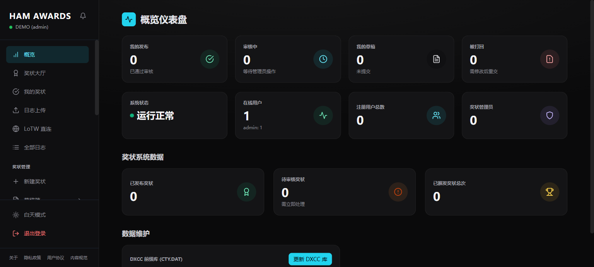
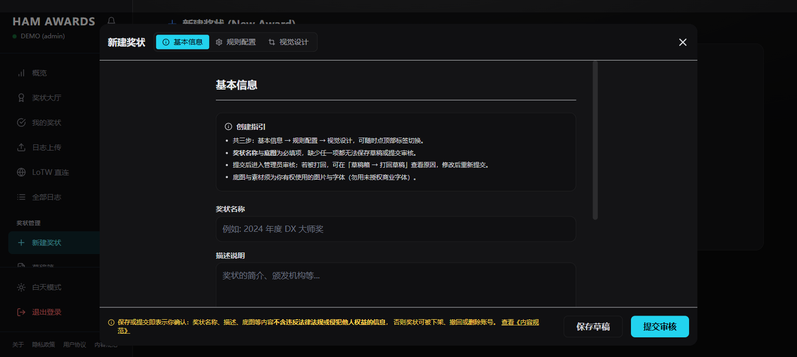

# Ham Radio Awards System · 业余无线电奖状系统

> **基于上游二次开发**：[BH2VSQ/Ham-awards-SelfDefine](https://github.com/BH2VSQ/Ham-awards-SelfDefine)
> （上游最新 commit `b4773ab`，许可证 **GPL-3.0**，已获作者授权二次开发）

业余无线电领域的奖状申请与管理平台：管理员**可视化设计**奖状模板，用户**申请并下载 PDF 奖状**，支持 **LoTW 免上传取日志**、**公开校验页防伪**。

<p align="center">
  <a href="./LICENSE"></a>
  
  
</p>

---

## 相比上游的主要改动

| 模块 | 说明 |
|---|---|
| **LoTW 免上传取日志** | 服务端代理拉取 LoTW，走**内存会话**（不落盘、不落库、关闭页面即清除），ADIF 解析后仅保留精简字段 |
| **可视化奖状设计器** | 拖拽元素（文字/形状/图片/二维码）、多等级差异（`levelOverrides`）、图层与撤销重做；布局统一存 **mm 单位的 v2 schema** |
| **PDF 导出** | 客户端 300 DPI 栅格化，所见即所得；内置**思源黑体/思源宋体**（SIL OFL 1.1，`public/fonts/`） |
| **公开校验页 + 二维码** | 纸质/PDF 奖状扫码验真，呼号脱敏显示 |
| **Hash 路由** | 刷新保持页面、链接可分享（原上游无路由） |
| **Tailwind 本地构建** | 离线可用，不依赖外网 CDN |
| **Docker 化部署** | `db` / `minio` / `app` / `installer` 一键编排 |
| **缺陷修复** | 新建奖状不返回 id、上传文件名中文乱码、PDF 导出卡死/串图、401 误踢登录等 |

更完整的技术方案与里程碑见 **[`ROADMAP.md`](./ROADMAP.md)**，架构约定见 **[`AGENTS.md`](./AGENTS.md)**。

---

## 技术栈

- 前端：React 18 + Vite 4 + Tailwind CSS 3 + lucide-react
- 后端：Express 4（单体 `server.js`）
- 存储：PostgreSQL + MinIO
- 鉴权：JWT + bcryptjs + TOTP 两步验证

---

## 快速开始

### Docker 部署（推荐）

```bash
cp .env.example .env      # 按需修改端口 / 密钥
docker compose up -d --build
# 访问 http://localhost:9993 （首次由 installer 容器自动完成安装）
```

详见 **[`DOCKER.md`](./DOCKER.md)**。

### 本机开发

```bash
npm install
docker compose up -d db minio   # 只跑基础设施（PostgreSQL + MinIO）
node server.js                   # 后端，http://localhost:9993
npm run dev                      # 前端热更新，http://localhost:5173（/api 代理到 9993）
```

> 端口说明：后端 **9993**、前端 **5173**（开发）/ `dist` 由后端静态托管（生产）。上游 README 里的 3003 已过时。

---

## 数据来源与第三方许可

- **DXCC 前缀数据** `data/cty.dat`：来自 [Country Files](https://www.country-files.com)（Jim Reisert, AD1C），依其约定自由再分发须保留署名与来源，详见 [`data/NOTICE.md`](./data/NOTICE.md)；同步方式见 `scripts/update-cty.mjs`。
- **字体**：思源黑体 / 思源宋体（SIL OFL 1.1），许可见 `public/fonts/LICENSE-*.txt`，**请勿删除**。
- **图标**：lucide-react（ISC）。
- **上游代码**：基于 [BH2VSQ/Ham-awards-SelfDefine](https://github.com/BH2VSQ/Ham-awards-SelfDefine) v2.2.0，已获作者 GPL-3.0 授权。

## 截图 / Screenshots

> 以下截图均在**独立演示库**截取，示例呼号为虚构（BG1ABC / VR2XYZ / BD3ZZZ），不含任何真实通联数据。

| 页面 | 说明 |
| --- | --- |
|  | 公开落地页：功能介绍与示例奖状 |
|  | 登录 / 注册（含 HamCQ 登录） |
|  | 管理员仪表盘与数据维护（DXCC 库一键更新） |
|  | 可视化奖状设计器（拖拽元素 / 多等级差异 / 撤销重做） |

补充截图（校验页、LoTW 直连、实物材料审核等）欢迎 PR。

## 许可证

[GPL-3.0](./LICENSE)，继承自上游。字体采用 SIL Open Font License 1.1（见 `public/fonts/LICENSE-*.txt`）。
